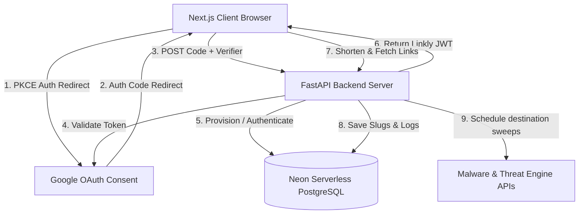

# Linkly Secure Shortener & Analytics SaaS Platform

Linkly is a modern, responsive, and secure URL shortening and analytics platform. Built with a robust Next.js frontend and a secure FastAPI backend, it protects target redirection routes with an hourly commercial-grade malware scanner, prevents phishing triggers, and tracks clicks, devices, and country demographics in real-time.

---

## 🚀 Features

*   **Secure Redirection**: Instantly shorten long target URLs with custom aliased slugs.
*   **Active Malware Scan**: An hourly proactive threat scan checks all destination URLs against Safe Browsing and spam blocklists.
*   **Google OAuth 2.0 with PKCE**: Secure authentication utilizing Proof Key for Code Exchange (PKCE) flow without storing credentials or long-term third-party access tokens in client storage.
*   **Real-time Analytics Console**: Visually tracking total link metrics, browser activity, device distributions, and geographic demographics.
*   **Dynamic Dark Mode**: Seamless, application-wide class-based dark mode switcher with local storage persistence and system preference sync.
*   **Responsive Layouts**: Fully responsive interface structured and verified to adapt perfectly across mobile, tablet, and desktop viewports.

---

## 🛠️ Tech Stack

### Frontend
*   **Framework**: Next.js (App Router, Turbopack)
*   **Styling**: Tailwind CSS v4
*   **State & Icons**: React Context API, Lucide React, React Icons (`FcGoogle`)

### Backend
*   **Framework**: FastAPI (Python 3.11)
*   **Database**: Neon Serverless PostgreSQL
*   **ORM**: SQLAlchemy & Alembic (Migrated successfully)
*   **Security**: JWT Tokenization, Passlib (bcrypt), Google Token Verification APIs

---

## 📐 Architecture Diagram



---

## 📦 Installation & Configuration

### Prerequisites
*   Python 3.10+
*   Node.js 18+
*   PostgreSQL database (e.g., Neon serverless)

### 1. Backend Configuration
Navigate to the `backend` folder, create your `.env` configuration file based on the template:
```bash
cd backend
cp .env.example .env
```
Fill out the variables inside `backend/.env`:
*   `DATABASE_URL`: Your PostgreSQL database connection string.
*   `JWT_SECRET`: A secure random cryptographic secret.
*   `GOOGLE_CLIENT_ID`: Your Google OAuth 2.0 Credentials client ID.
*   `GOOGLE_CLIENT_SECRET`: Your Google OAuth 2.0 Credentials client secret.

Install dependencies and start the backend development server:
```bash
pip install -r requirements.txt
python -m uvicorn src.main:app --host 127.0.0.1 --port 8000 --reload
```

### 2. Frontend Configuration
Navigate to the `frontend` folder, create your `.env.local` configuration:
```bash
cd ../frontend
cp .env.local.example .env.local
```
Fill out the variables inside `frontend/.env.local`:
*   `NEXT_PUBLIC_API_URL`: Set to `http://127.0.0.1:8000` for local environment.
*   `NEXT_PUBLIC_GOOGLE_CLIENT_ID`: Your Google client ID (must match the backend credentials).

Install dependencies and start the Next.js development server:
```bash
npm install
npm run dev
```

The application will now be running on [http://localhost:3000](http://localhost:3000)!

---

## 📡 API Endpoints

### Authentication
*   `POST /auth/register`: Create a new user with standard credentials.
*   `POST /auth/login`: Authenticate standard credentials and issue JWT.
*   `POST /auth/google`: Process Google OAuth 2.0 authorization codes and exchange them securely using client-side PKCE verifiers.

### URL Infrastructure
*   `POST /shorten`: Generate a secure short link.
*   `GET /urls`: Fetch all links owned by the currently authenticated user.
*   `GET /url/{id}`: Retrieve detailed metadata and logs for a specific shortened link.
*   `PUT /url/{id}`: Modify the destination target of an existing slug.
*   `DELETE /url/{id}`: Remove a shortened slug permanently.

### Safety Redirections
*   `GET /{short_code}`: Safely check database, increment redirect logs and click counts, verify destination safety, and redirect client browser.

---

## 🛡️ Environment Variables

### Backend (`backend/.env.example`)
```env
DATABASE_URL=your-database-connection-url
JWT_SECRET=your-jwt-signing-secret
GOOGLE_CLIENT_ID=your-google-client-id
GOOGLE_CLIENT_SECRET=your-google-client-secret
```

### Frontend (`frontend/.env.local.example`)
```env
NEXT_PUBLIC_API_URL=your-backend-api-url
NEXT_PUBLIC_GOOGLE_CLIENT_ID=your-google-client-id
```

---

## 🌐 Deployment Guide

### Backend (Docker & FastAPI)
1.  Build and run using the included Dockerfile:
    ```bash
    docker build -t linkly-backend ./backend
    docker run -p 8000:8000 linkly-backend
    ```
2.  Deploy directly to serverless platforms like Render, Railway, or AWS ECS.

### Frontend (Next.js)
1.  Build optimized static files:
    ```bash
    npm run build
    ```
2.  Deploy production builds on Vercel, Netlify, or AWS Amplify.

## ✍️ Author

Created by **Geethanjali** (Geethanjaliii/linkly).
License: [MIT](LICENSE)
